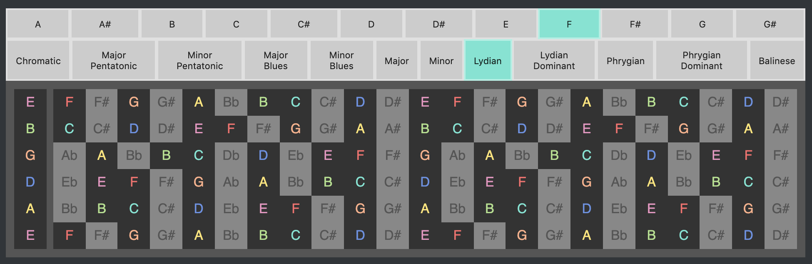

# React Fretboard



The aim of this project is to provide a highly configurable fretboard component allowing tutorial creators to show scales, modes, chords and any other musical concept they wish with just a few configuration properties.

There's still plenty of work to be done to get to that point, but the scale demo shown in the screenshot above should give some idea about that vision.

I'd love your feedback (and contributions!), so please feel welcome to open an issue, or PR!

### Up & Running

```sh
npm install && npm start
```
